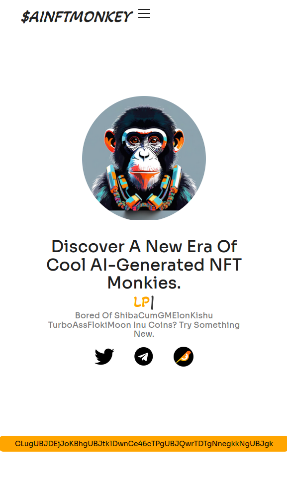

# AINFTMONKEY

Welcome to the official website of AINFTMONKEY, an innovative NFT project. This website is built using React, JavaScript, CSS, and HTML.

<p align="center">
  
</p>

<p align="center">
  
  
</p>

## Table of Contents
- [Introduction](#introduction)
- [Features](#features)
- [Installation](#installation)
- [Usage](#usage)
- [License](#license)

<p align="center">
  
</p>

## Introduction
AINFTMONKEY is a unique NFT project that brings together art and technology. Our website provides a seamless experience for users to explore and interact with our NFTs.

<p align="center">
  
</p>

## Features
- **Interactive UI**: Built with React for a dynamic user experience.
- **Responsive Design**: Ensures compatibility across various devices.

<p align="center">
  
</p>

## Installation
To get started with the project, follow these steps:

1. Clone the repository:
    ```bash
    git clone https://github.com/VHPL-UIS/ainftmonkey.git
    ```
2. Navigate to the project directory:
    ```bash
    cd ainftmonkey
    ```
3. Install dependencies:
    ```bash
    npm install
    ```

<p align="center">
  
</p>

## Usage
To run the project locally, use the following command:
```bash
npm start
```
This will start the development server and you can view the website at `http://localhost:3000`.

## License
This project is licensed under the MIT License.
